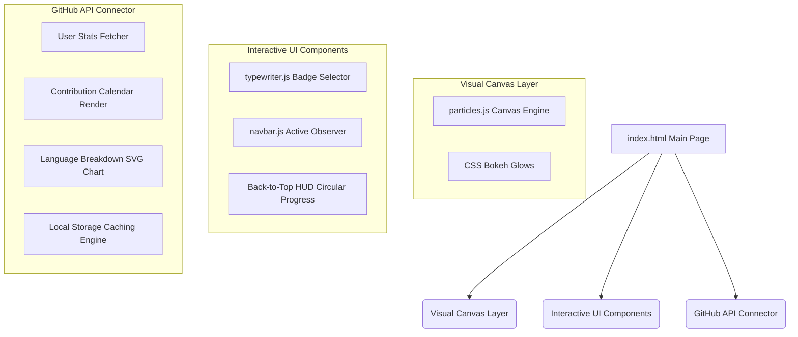

# 🌌 HelloAnkita.dev
> **A futuristic, cyberpunk-themed portfolio built with vanilla CSS, glassmorphism, and live GitHub API integration.**

<p align="left">
  
  
  
  
  
  
</p>

---

## ✨ Design Philosophy & Aesthetics

The application represents a high-fidelity digital hub showcasing creative code capabilities. 

*   **Vibrant Cyberpunk Accents:** Structured around deep slate layers (`#030a10`) highlighted by high-contrast neon accents: Cyan (`#00e5ff`), Purple (`#9d4edd`), and Pink (`#ff007f`).
*   **Atmospheric Depth:** Background drifting bokeh lights move dynamically, creating a fluid, floating, premium environment.
*   **Modern Typography:** Styled with Google Fonts pairing of `Space Grotesk` (for futuristic headings) and `Plus Jakarta Sans` (for clean, responsive body text).

---

## ⚡ Interactive Features



### 🛰️ Core Modules & Mechanics

| Module | Core Logic | Style Elements | Experience Description |
| :--- | :--- | :--- | :--- |
| **HUD Navigation** | `js/components/navbar.js` | `CSS/components/navbar.css` | A scroll-shrinking, blurring navigation header with active section track via `IntersectionObserver`. |
| **Interactive Particles** | `js/components/particles.js` | HTML5 Canvas Context | Connective drifting particle nodes that respond to browser window viewport scaling. |
| **Typewriter Badge** | `js/components/typewriter.js` | `CSS/components/home.css` | Cycles between: *AI & ML Developer*, *Python Developer*, and *Full Stack Developer*. |
| **GitHub Dashboard** | `js/components/github.js` | `CSS/components/stats.css` | Fetches live user statistics, generates contribution calendars, and draws an interactive SVG language chart. |

> [!TIP]
> **Performance Optimized:** The drifting bokeh animations and canvas particles use lightweight keyframes and standard animation loop ticks to maintain a target 60FPS on both mobile and desktop viewports.

---

## 📁 Repository Blueprint

Here is a visual map of the repository's modules:

```text
HelloAnkita/
├── CSS/
│   ├── components/
│   │   ├── about.css       # About section profile & planetary orbit mechanics
│   │   ├── global.css      # Drifting lights, base resets, and scrollbar stylings
│   │   ├── home.css        # Hero elements & typewriter layout positioning
│   │   ├── navbar.css      # Header layouts, blurring, & circular HUD tracker
│   │   ├── stats.css       # Git metrics dashboard, grids, and calendar nodes
│   │   └── variables.css   # Tailored HSL color variables & font families
│   └── style.css           # Global stylesheet rollup importing modular CSS
├── js/
│   └── components/
│       ├── github.js       # Live API stats fetch, rendering engine, & local caching
│       ├── navbar.js       # Active highlight, hamburger toggles, and scroll track
│       ├── parallax.js     # Responsive cursor/mouse-axis movement tracker
│       ├── particles.js    # Background interactive canvas particle network
│       └── typewriter.js   # Hero title typewriter loop sequencer
├── assets/
│   ├── profile.jpg         # Profile image resource
│   └── resume.pdf          # Professional developer resume
├── index.html              # Main site structural markup
└── README.md               # User manual & documentation
```

---

## ⚙️ Setup & Customization

### Local Development
To launch the application locally, you can serve it with any lightweight HTTP utility:

> [!IMPORTANT]
> A local server is recommended to ensure the live GitHub API fetches and SVG charts render correctly without violating local origin file constraints in the browser.

```bash
# Using Python
python -m http.server 8000

# Using Node.js (npx)
npx http-server -p 8000
```
Then visit **`http://localhost:8000`** in your browser.

---

### Customizing for Your Own Profile

1.  **Configure GitHub Feed:** Open [js/components/github.js](file:///g:/My%20Drive/AB/HelloAnkita/js/components/github.js) and modify the fallback username to point to your profile:
    ```javascript
    const DEFAULT_USERNAME = "YourGitHubUsername";
    ```
2.  **Update Content:** Edit bios, links, and profile details inside [index.html](file:///g:/My%20Drive/AB/HelloAnkita/index.html).
3.  **Swap Assets:** Replace `assets/profile.jpg` and `assets/resume.pdf` with your own assets.

---

<p align="center">
  <sub>Designed with ❤️ by Ankita Bera</sub>
</p>
